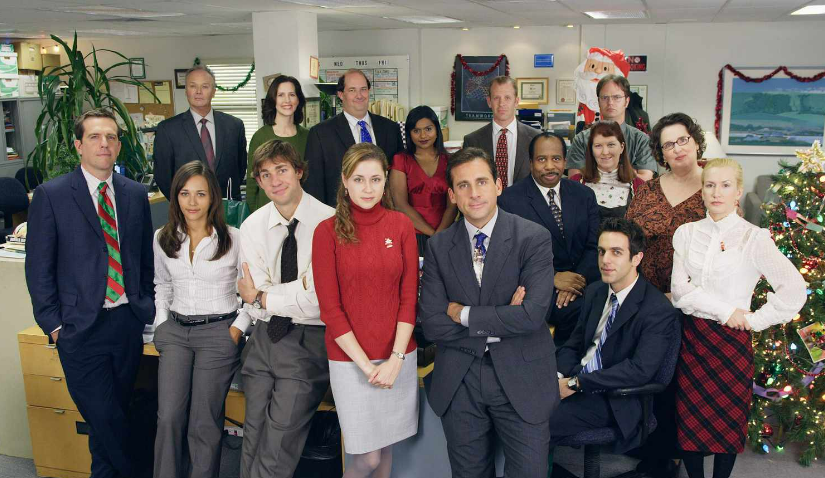
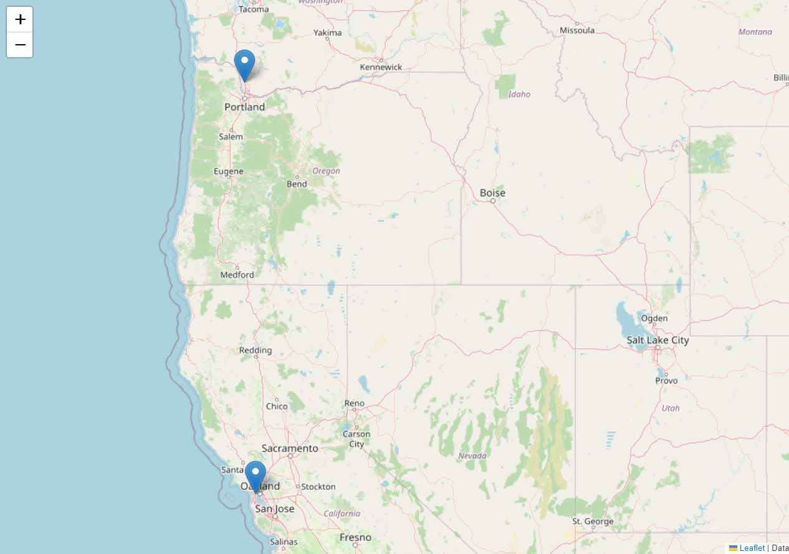
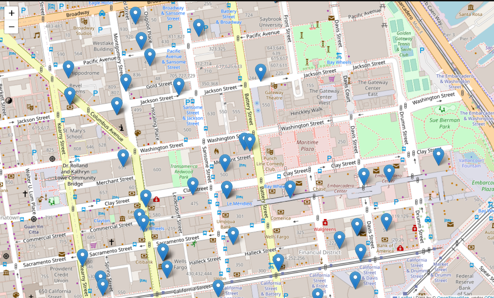
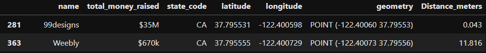
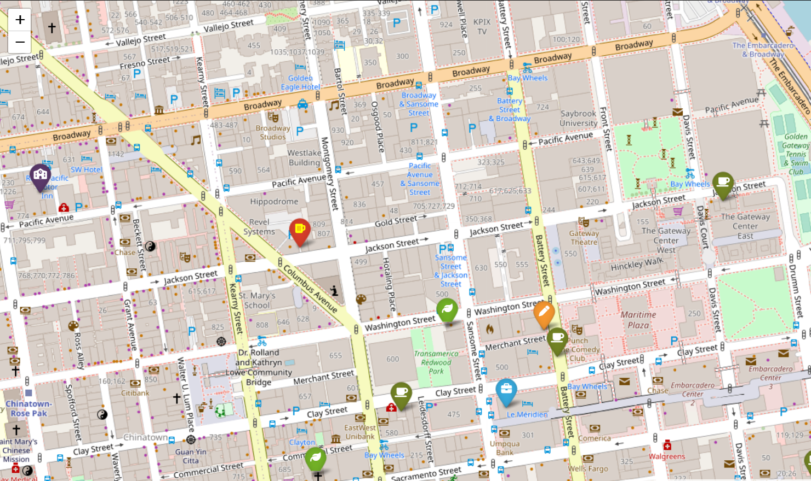

# **Project 3 -> GeoSpatial Data Project (Looking for a new office)**

The goal of this project is looking for a new venue for a our gaming company. In order to choose the location, we have to take into account the following;

- Designers like to go to design talks and share knowledge. There must be some nearby companies that also do design.

- 30% of the company staff have at least 1 child.

- Developers like to be near successful tech startups that have raised at least 1 Million dollars.

- Executives like Starbucks A LOT. Ensure there's a starbucks not too far.

- Account managers need to travel a lot.

- Everyone in the company is between 25 and 40, give them some place to go party.

- The CEO is vegan.

- If you want to make the maintenance guy happy, a basketball stadium must be around 10 Km.

- The office dog—Dobby needs a hairdresser every month. Ensure there's one not too far away.

We had 3 options in order to acomplish this goal and, of course, we have picked the funnier one: **Steal other company's venue.**

## **1. Exploring companies collection**

We have been given a mongoDB collection called companies. This collection contains relevant information form several companies around the world.

### **1.1 Checking Design companies**

Since one of the "nice to have" is being close to a design company, we have decided to start from here. 

We have selected the companies that matches the category_code 'design'. After that, we have done the following:

- Check how many design companies de we have on the collection
- Look at the companies country. Since we found out that the most of them where placed on US we will aim on those.   
- Once we have filterd all the vanues we have two cadidates left. Find both below on the map. 

After exploring both companies and neighborhoods, we have concluded that our finalist is **99designs**. San Francsico financial Disctrict is, for sure, a great option considering all requirements. 

### **1.2 Looking for nearby companies**

In order to perform this analysis, we first have to filter those that have 'CA' as state code. 

Once we have a df with the companies that are placed in California we can add another column called distance_meters with the calculation of the meters of distance between the companies and 99designs venue.  

### **1.3 Selecting venue to steal**
After generating this new column, our next step is filter the companies that are less than 500 meters away from our 99desgins selected companies. 

From this photo above we have selected the company we want to steal their venue from: **Weebly**.

This company has, unlike the others, raised less than 1M and it is one block away from our beloved design company 99designs. 

## **2. Explore area surroundings**

For this last part, before sharing the final location and map, we want to make sure that we have our "basic needs" covered. With the goal of doing it, we must check the following:

- Nearby Starbucks
- Nearby pre-schools
- Nearby Pubs
- Nearby vegan-friendly restaurants

Once we have had collected all this information we have created a df with a new column called type, whitch gives the category information. 

## **3. Final map**

With all this information we can already deliver the location in which we will establish our new venue. 

In the map below you can find:

- **Starbucks** with the **coffe icon**
- Our **new office** with a **briefcase icon**
- **99desgins** company location respresented with a **pen icon**
- **Vegan-friendly restaurants** with a **lief**
- **Pubs**, obviously, represented with a **beer** 
- **Pre-school** respresented with a **building icon**

Additionally, since it is not shown on the map, note that:

- Our beloved maintenance guy will be able to go tho the stadium of one of the best basketball teams in the world: The Golden State Warriors 

- Our developers will be able to enrich their network since they have several companies around with more than 1M valuation

New location: [37.795555 ,-122.400729]

